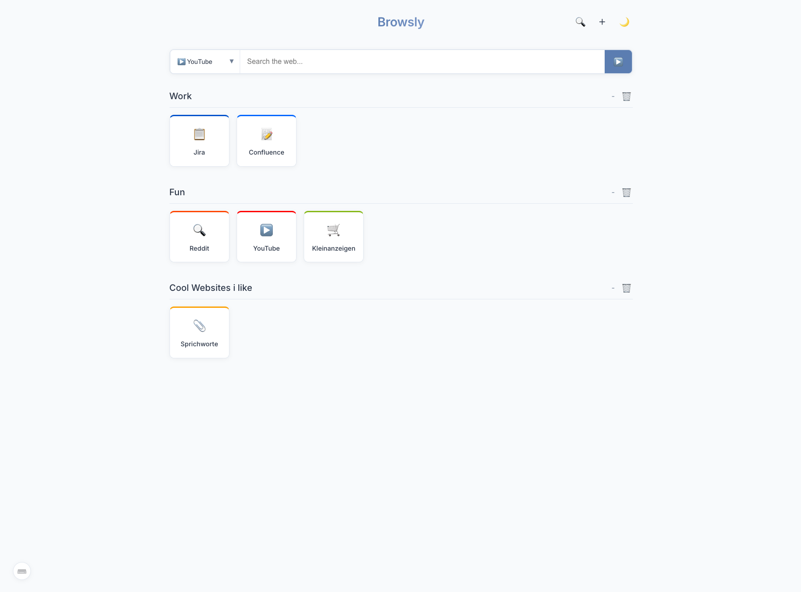
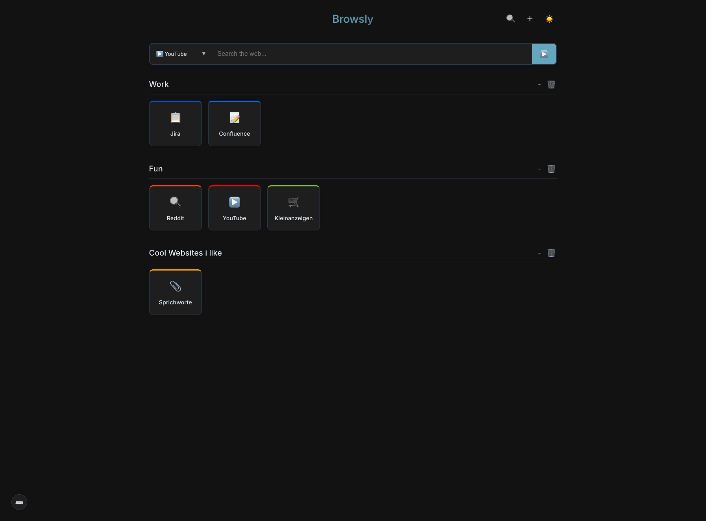

# Dashboard

A modern, customizable personal dashboard application built with React, TypeScript, and Vite.

## Screenshots

### Light Mode


### Dark Mode


## Features

- **Customizable Link Sections**: Organize your favorite links into collapsible categories
- **Search Integration**: Quick access to web search engines
- **Dark/Light Mode**: Toggle between themes for comfortable viewing
- **Responsive Design**: Works on desktop and mobile devices
- **Local Storage**: Your dashboard configuration persists between sessions
- **Keyboard Shortcuts**: Navigate efficiently with keyboard shortcuts
- **Emoji Icons**: Personalize your links with emoji icons
- **Color Customization**: Assign custom colors to your links
- **Notifications System**: Receive feedback on actions

## Getting Started

### Prerequisites

- Node.js (v18 or higher)
- npm or yarn

### Installation

1. Clone the repository:
   ```bash
   git clone https://github.com/yourusername/dashboard.git
   cd dashboard
   ```

2. Install dependencies:
   ```bash
   npm install
   # or
   yarn
   ```

3. Start the development server:
   ```bash
   npm run dev
   # or
   yarn dev
   ```

4. Open your browser and navigate to `http://localhost:5173`

## Building for Production

```bash
npm run build
# or
yarn build
```

The build artifacts will be stored in the `dist/` directory.

## Usage

### Adding Links

1. Click the "+" button in the bottom right corner
2. Fill in the link details (name, URL, icon, color)
3. Select an existing section or create a new one
4. Click "Add Link"

### Adding Categories

1. Click the "+" button in the bottom right corner
2. Click "Add New Category" at the bottom of the form
3. Enter the category name
4. Click "Add Category"

### Managing Links and Categories

- **Collapse/Expand Sections**: Click on the section header
- **Delete Links**: Hover over a link card and click the delete icon
- **Delete Categories**: Empty categories can be deleted by clicking the delete icon in the section header

### Keyboard Shortcuts

- `/` - Focus the search box
- `Esc` - Clear search or close modals
- `Alt+D` - Toggle dark mode

## Project Structure

```
dashboard/
├── public/          # Static assets
├── src/
│   ├── assets/      # Images and other assets
│   ├── components/  # React components
│   ├── utils/       # Utility functions
│   ├── App.tsx      # Main application component
│   ├── App.css      # Application styles
│   ├── index.css    # Global styles
│   ├── main.tsx     # Entry point
│   └── types.ts     # TypeScript type definitions
├── index.html       # HTML template
├── package.json     # Dependencies and scripts
├── tsconfig.json    # TypeScript configuration
└── vite.config.ts   # Vite configuration
```

## Technologies Used

- [React](https://reactjs.org/) - UI library
- [TypeScript](https://www.typescriptlang.org/) - Type safety
- [Vite](https://vitejs.dev/) - Build tool and development server
- [CSS Modules](https://github.com/css-modules/css-modules) - Scoped CSS

## Contributing

1. Fork the repository
2. Create your feature branch (`git checkout -b feature/amazing-feature`)
3. Commit your changes (`git commit -m 'Add some amazing feature'`)
4. Push to the branch (`git push origin feature/amazing-feature`)
5. Open a Pull Request

## License

This project is licensed under the MIT License - see the LICENSE file for details.

## Acknowledgments

- Emoji icons provided by native browser support
- Inspired by various dashboard applications and start pages

## PM2 Setup for Auto-start on System Boot

This project includes a PM2 configuration file that allows the dashboard to automatically start on system boot.

### Prerequisites

- [PM2](https://pm2.keymetrics.io/) installed globally:
  ```bash
  npm install -g pm2
  ```

### Configuration

1. Edit the `ecosystem.config.cjs` file and update the `cwd` path to match your project location:
   ```javascript
   cwd: "/path/to/your/project", // Change this to your actual project path
   ```

2. Build the project for production:
   ```bash
   npm run build
   # or
   yarn build
   ```

3. Start the application with PM2:
   ```bash
   pm2 start ecosystem.config.cjs
   ```

4. Save the current PM2 process list:
   ```bash
   pm2 save
   ```

5. Generate startup script (this will output a command you need to run with sudo):
   ```bash
   pm2 startup
   ```

6. Run the command that PM2 provides in the previous step.

7. To verify the setup, you can restart your system and check if the dashboard starts automatically.

### Managing the PM2 Process

- Check status: `pm2 status`
- Restart application: `pm2 restart dashboard`
- Stop application: `pm2 stop dashboard`
- Remove application from PM2: `pm2 delete dashboard`
- View logs: `pm2 logs dashboard`

For more information about PM2, visit the [official documentation](https://pm2.keymetrics.io/docs/usage/quick-start/).
